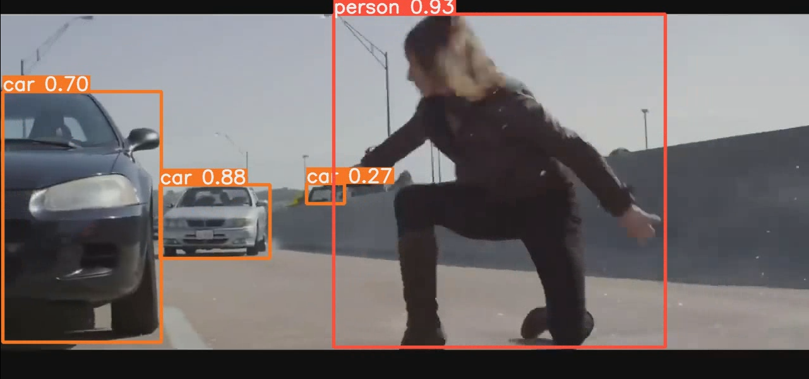

# YOLOv5 를 활용한 객채 탐지 기초 및 실습
***

>## yolov5 폴더
> - 기본적으로 yolov5 폴더 안의 `detect.py` 파일로 객체 탐지를 수행.
> - segmentation 탐지는 `yolov5/segment/predict.py` 파일로 객체 탐지를 수행.
> - Bounding box 객체일 경우 `python detect.py --weights yolov5s.pt --source {subject_path}` 코드를 통해 객체 탐지를 실시.
> - Segmentation 탐지는 `python segment/predict.py --weights yolov5s-seg.pt --source {subject_path}` 코드를 통해 객체 탐지를 실시.
> - 각각 탐지 결과는 `yolov5/runs` 폴더 안에 저장 됩니다.

>## 객체 탐지 결과 샘플 이미지
> - `car_detect.pt` 로 `Object/car01.jpg` 객체 탐지 
>***
> - `yolov5s.pt` 로 `Object/natasha.mp4' 객체 탐지 스크린샷 
>***
> - `mask_unmask.pt` 로 `Object/mask_unmask.jpg` 객체 탐지 

>## Dectected Object 폴더
> - 학습된 모델로 Object를 객체 탐지한 결과 사진 또는 동영상.

>## Object 폴더
> - 각 학습된 모델의 테스트를 위해 사용 될 사진 또는 동영상.

>## Roboflow_upload_image 폴더
> - Roboflow에 `mask_unmake.pt` 모델을 만들기 위해 모은 사진.
> - 마스크 쓴 사진과 마스크 안쓴 사진.

>## trained_models 폴더
> - **car_detect.pt**
>   - Bounding box로 객체 탐지.
>   - 자동차 탐지.
> - **car_seg.pt**
>   - Instance segmentation으로 객체 탐지.
>   - 자동차 탐지
> - **mask_unmask.pt**
>   - Roboflow 사이트를 활용하여 직접 Dataset 작성한 후 모델 학습.
>   - 마스크를 쓴 모습과 안 쓴 모습을 구분.
> - **sign_seg.pt**
>   - Sign_Language를 Instance Segmentation으로 객체 탐지.
>   - A-Z 까지 수화를 탐지.

>## Training in Colab 폴더
> - 각 모델들을 학습한 소스 코드
> - Google의 Colab으로 작성하였습니다.

>## [Portfolio] YOLOv5_basic.pptx
> - 해당 과정 포트폴리오 ppt 입니다.

